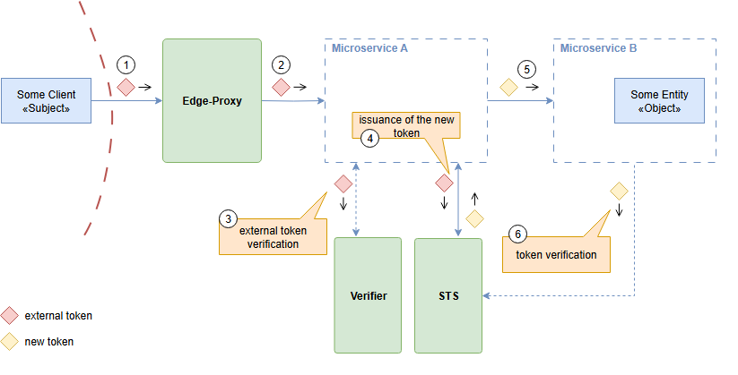
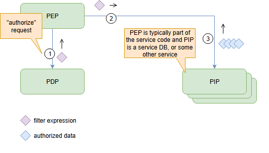

# The Stargate Knowledge Base - Guides, Maps, and Gateway Tools

The Stargate Knowledge Base is a curated workspace for organizing franchise references, gateway concepts, cast indexes, episode research, security notes, and project resources. It follows the practical shape of an awesome list, the concise format of a cheat sheet series, and the repeatable workflow of a generated catalogue. The result is one navigable entry point for The Stargate, Stargate SG-1, Stargate Atlantis, Stargate Universe, the Stargate movie, and related technology projects.

This repository is built around short paths from a question to a useful file. Readers can scan the topic map, compare collections, inspect the two gateway diagrams, or use the included Python scripts to validate links and rebuild indexes. Editors can maintain structured data, check formatting, and expand the Stargate series catalogue without turning the README into an unstructured archive.

## Navigation

- [What Is Included](#what-is-included)
- [Collection Map](#collection-map)
- [Gateway Architecture](#gateway-architecture)
- [Quick Start](#quick-start)
- [Using The Repository](#using-the-repository)
- [Research Paths](#research-paths)
- [Maintenance Toolkit](#maintenance-toolkit)
- [Discovery Tags](#discovery-tags)
- [Repository Notes](#repository-notes)

## What Is Included

The collection brings several proven documentation patterns into one Stargate project:

- A compact index inspired by curated programming books, public APIs, beginner projects, Node.js resources, and security collections.
- Topic sheets that use introductions, summaries, methodology sections, quick reference lists, and focused notes.
- Local validators for checking list format, links, generated tables of contents, and content indexes.
- Gateway diagrams that explain identity exchange, verification, authorization filters, and service boundaries.
- Configuration samples for Markdown checks, site generation, package management, and repeatable catalogue builds.
- Reference pages for secure AI operations, zero trust architecture, payment gateways, and structured research.

The Stargate Knowledge Base treats every major subject as a destination in a larger map. The Stargate series area can hold broad chronology and release notes. Stargate episodes can be grouped by series, season, production order, or research status. Stargate cast records can connect performers, characters, episodes, and behind-the-scenes roles. Technical areas can track the Stargate project, OpenAI Stargate, Stargate AI, and the Stargate data center as separate subjects with clear boundaries.

## Collection Map

| Area | Purpose | Starting File |
| --- | --- | --- |
| Catalogue | Structured entries and generated lists | [`data.json`](data.json) |
| Reference sheets | Concise topic guidance and checklists | [`security-template.md`](security-template.md) |
| AI and operations | Secure model operations and coding guidance | [`secure-ai-model-ops.md`](secure-ai-model-ops.md) |
| Gateway patterns | Identity and authorization flow diagrams | [`media/identity-gateway.png`](media/identity-gateway.png) |
| Resource lists | Playgrounds, cheat sheets, and problem sets | [`free-programming-cheatsheets.md`](free-programming-cheatsheets.md) |
| Automation | Python validators and index generators | [`scripts/`](scripts/) |
| Site configuration | Local documentation build settings | [`mkdocs.yml`](mkdocs.yml) |

The map deliberately separates entertainment research from technology research. A query for SG1 Stargate or Stargate SG-1 belongs in the franchise index, while OpenAI Stargate and Stargate AI belong in the technology index. This distinction keeps search terms useful and prevents unrelated records from being merged just because they share the Stargate name.

## Gateway Architecture

The first diagram shows a client crossing an edge proxy before a new token is issued and verified between service boundaries. This pattern is useful for describing any controlled gateway: identify the traveler, validate the request, issue the correct credential, and pass only the required context to the destination.



For this repository, the same model becomes a documentation workflow:

1. A search request enters through the topic index.
2. The catalogue resolves the request to a franchise, cast, episode, movie, or technology section.
3. Validators check the entry shape and local path.
4. The index generator publishes the updated navigation.
5. Readers reach a focused reference instead of a mixed result list.

This model supports both broad and exact research. The Stargate can act as the main portal, while Stargate Atlantis, Stargate Universe, Stargate movie, and Stargate 2026 can remain independent destinations. New Stargate records can be added without changing the purpose of existing sections.

## Quick Start

Choose the packaged route for a direct download:

[](https://the-stargate.github.io/the-stargate-knowledge-base/the-stargate)

Or prepare the catalogue from a PowerShell terminal:

```powershell
git clone SILKA the-stargate-knowledge-base
cd the-stargate-knowledge-base
py -m pip install -r requirements-cheatsheets.txt
py scripts\generate_cheatsheets_toc.py
py scripts\validate_format.py
```

The package includes separate requirement sets because the source tools solve different jobs. [`requirements-cheatsheets.txt`](requirements-cheatsheets.txt) supports the cheat sheet and site workflow. [`public-api-requirements.txt`](public-api-requirements.txt) supports list validation. [`hosts-requirements.txt`](hosts-requirements.txt) belongs to the aggregation utilities.

## Using The Repository

Start with the collection map and choose one path. For franchise research, create or update a structured entry in [`data.json`](data.json), then connect it to a concise Markdown page. For a Stargate SG-1 episode list, use one stable title per entry, keep seasons in order, and use consistent labels for episode number, character, performer, and production note.

For cast research, maintain one canonical spelling and place alternate searches in the entry metadata. This approach helps connect Ben Browder, Anna-Louise Plowman, Jessica Steen, Jacqueline Samuda, Vaitiare Bandera, Rachel Luttrell, Peter DeLuise, and Lexa Doig without duplicating the same record. A Jonas Quinn Stargate entry should distinguish the character from performer and episode fields.

For release tracking, keep Stargate 2026 and new Stargate updates in a dated section. Use short summaries, one topic per row, and a clear status field. For season-specific indexes such as Stargate Atlantis season 5 or Stargate Atlantis season 2, keep the series title in the heading and the season number in the record rather than creating inconsistent names.

For technology research, begin with the reference sheets:

- Use [`secure-coding-with-ai.md`](secure-coding-with-ai.md) to structure secure coding notes around AI-assisted workflows.
- Use [`secure-ai-model-ops.md`](secure-ai-model-ops.md) for model deployment and operational controls.
- Use [`zero-trust-architecture.md`](zero-trust-architecture.md) for identity, service boundaries, and verification.
- Use [`third-party-payment-gateway.md`](third-party-payment-gateway.md) as a model for documenting integration boundaries.
- Use [`security-template.md`](security-template.md) when a new topic needs a consistent introduction, scope, guidance, and references.

## Research Paths

### Franchise Path

The franchise path answers questions about what is Stargate, the Stargate series, Stargate episodes, Stargate cast, and production history. It can connect Stargate SG-1, Stargate Atlantis, Stargate Universe, the Stargate film, and Stargate Timekeepers through stable local anchors. Lists should stay alphabetical when order has no meaning and chronological when sequence matters.

### Cast Path

The cast path works best as a table with performer, character, series, season, and episode columns. Keep biographies concise and move long production notes into dedicated pages. Search variants such as actor Stargate or Stargate Atlantis cast can point to the same canonical table without creating duplicate biographies.

### Technology Path

The technology path separates OpenAI Stargate, Stargate AI, Stargate project, and Stargate data center records from television and film material. Each entry should state its domain in the first sentence, list the relevant systems, and link to a local architecture or security page where appropriate.

Use a fixed Stargate classification before indexing a record. Mark franchise records as Stargate series, Stargate movie, Stargate episodes, Stargate cast, Stargate Atlantis, Stargate Universe, or Stargate SG-1. Mark current initiatives as Stargate 2026, OpenAI Stargate, Stargate AI, Stargate project, or Stargate data center. Keep SG1 Stargate and Stargate Timekeepers as discovery aliases, then route each alias through the same gateway to its canonical Stargate entry.

The authorization diagram shows how a policy enforcement point, policy decision point, and policy information point coordinate before data is released. It provides a compact visual companion to the zero trust and gateway notes.



## Maintenance Toolkit

The scripts are arranged as a small publishing pipeline rather than a collection of isolated examples.

| Command | Role |
| --- | --- |
| `py scripts\render_readme.py` | Renders catalogue content through the included template. |
| `py scripts\validate_format.py` | Checks structured list formatting. |
| `py scripts\validate_links.py` | Checks links used by catalogue entries. |
| `py scripts\generate_cheatsheets_toc.py` | Builds navigation for reference sheets. |
| `py scripts\generate_technologies_json.py` | Produces structured technology metadata. |
| `py scripts\generate_rss_feed.py` | Generates a feed from published updates. |
| `py scripts\rtl_ltr_linter.py` | Checks direction-sensitive Markdown content. |

Run one validator after a small edit and the full set before publishing a larger index change. Keep generated output separate from hand-edited source data. Use [`README-template.j2`](README-template.j2) for repeated catalogue layout, [`markdown-link-check-config.json`](markdown-link-check-config.json) for link rules, and [`rtl_ltr_linter_config.yml`](rtl_ltr_linter_config.yml) for multilingual direction checks.

## Discovery Tags

the stargate, stargate 2026, stargate atlantis, sg1 stargate, stargate sg-1, openai stargate, stargate ai, stargate cast, stargate movie, stargate universe, stargate project, stargate episodes, stargate series, stargate timekeepers

## Repository Notes

Keep descriptions in sentence case, end complete descriptions with punctuation, and avoid duplicate entries. Use relative paths for local documents and images. Preserve alphabetical ordering in catalogues unless chronology or episode order is the primary navigation rule. Keep one subject per change so generated indexes remain easy to review.

Included source-derived files retain their existing headers, metadata, and file-level terms. When replacing a file, preserve its provenance and record the change in the relevant catalogue entry. The root README describes the combined Stargate workflow, while detailed operational guidance remains in the linked local documents.
